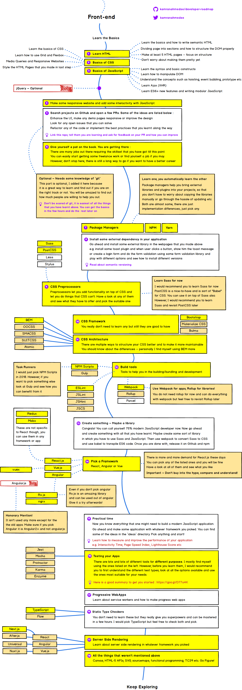

## 수업내용 정리

### 프로그래밍이란?

- 프로그래밍 언어: 의사소통을 위한 수단. 컴퓨터와 대화하기 위해선 2진수로 구성된 기계어를 사용해야 한다.
> 프로그래밍 언어는 semantics(의미)와 syntax(구문)으로 조합된 표현.
> 약속된 문법(syntax)을 사용해서 프로그램 작성 후, 그것을 컴퓨터가 이해할 수 있도록 번역하는 일종의 번역기를 컴파일러 혹은 인터프리터라고 한다.

- 프론트엔드 개발 공부 할 때 참고해야 할 이미지


### JavaScript란?
1. HTML,CSS와 함께 웹을 구성하는 요소중 하나로 웹 브라우저에서 동작하는 유일한 스크립트 언어.
2. JavaScript는 멀티패러다임 언어로 명령형, 함수형, 프로토타입 기반의 객체지향 언어다.
> 객체지향: 프로그래밍을 하는 대상을 하나의 객체로 본다. 객체는 데이터와 행위가 있다. JavaScript는 객체를 바로 생성 가능하다.
3. SPA(Single Page Application)가 대중화되면서 Angular, React, Vue.js 등 다양한 SPA Framework/Library가 많은 사용층 확보
4. ECMAScript
- ECMAScript 3: 가장 범용적으로 지원
- ECMAScript 5: HTML5와 함께 출현하여 HTML5의 모듈을 맞추기 위해 나옴. ES6와 코딩 방식이 다르고 IE8이상에서 웬만해선 지원
- ECMAScript 6: 브라우저 마다 모듈화가 완벽하지 않음. let, const 키워드, Arrow Function, class, Symbol 타입 등이 추가.
5. JavaScript는 상호작용을 하는 웹페이지 작성을 가능하게 한다. 
6. HTML은 웹페이지의 내용과 구조를 담당한다. CSS는 HTML을 꾸미고 레이아웃을 잡는 역할을 하고 JavaScript는 동적 기능을 부여하는 것이다. 따라서 HTML,CSS,JavaScript는 역할(관심사)이 다르므로 분리된 파일로 작성하는 것이 바람직하다.
7. JavaScript가 가장 많이 사용되는 분야는 역시 웹 브라우저 환경에서 동작하는 웹 페이지/애플리케이션이다.
8. 브라우저의 주요 기능은 사용자가 참조하고자 하는 웹페이지를 서버에 요청하고 응답을 받아 브라우저에 표시하는 것이다. 브라우저는 서버로부터 html, css, javascript 파일을 응답받는다. html, css 파일은 렌더링 엔진의 HTML 파서와 CSS 파서에 의해 파싱되어 DOM, CSSOM 트리로 변환되고 렌더 트리로 결합된다.
```
1. 브라우저의 파서가 HTML을 읽어들인다
2. 맨 위부터 한 줄씩 읽어서 브라우저의 엔진이 이해할 수 있는 이진법으로 바꿔서 메모리에 기억
3. css파싱하는 파서에게 전달 
4. 메모리에 저장해서 뒤에 해당 태그가 나올 때 변경하기 위해 저장
5. html 파싱하는 파서에게 전달
6. DOM에 얹음
7. JAVAScript 파서에게 전달
8. 다시 html 파서에게 전달
9. 따로 읽은 것을 뭉쳐서 화면에 그리는 렌더링 작업을 거침
```

### Javascript Syntax Basics
1. 구문 (Statement)
- 스크립트는 순차적으로 수행될 명령들의 집합이다.
- 각각의 명령을 구문(statement)이라한다. 구문은 값(Value), 연산자(Operator), 표현식(Expression), 키워드(Keyword), 주석(Comment)으로 구성되며 세미콜론( ; )으로 끝나야 한다.
- 코드블록 {}로 열고 닫아 그룹화 할 수 있다. 그룹화하여 함께 실행되어져야 하는 구문의 정의하기 위함이며 나중에 재사용 할 수 있다. 코드블록의 안에는 구문으로 이루어져 있고 순차적으로 실행된다.
- 순차적인 실행중에 조건문(if, switch)이나 반복문(while, for)의 사용으로 제어할 수 있다 이를 흐름제어(Control Flow)라 한다.
2. 표현식 (Expression)
- 표현식(Expression)은 값, 변수, 연산자의 조합이며 이 조합은 연산을 통해 하나의 값을 만든다. 
3. 변수 (Variable)
- 프로그래밍 언어에서 변수는 값(value)을 저장(할당), 참조하기 위해 사용된다.
- 변수는 위치(메모리상의 주고)를 의미한다. 
4. 값 (Value)
- 자바스크립트는 7가지 데이터 타입을 제공
```
1. Boolean : true or false
2. null : 명시적으로 값이 없음을 나타냄
3. undefined : 정의되어 있지 않음. 변수 선언 이후 값을 가지고 있지 않은 상태
4. Number 
5. String
6. Symbol : (New in ECMAScript 6)
7. Object : 기본형과 메모리를 확보하는 방법이 다름
```
5. 연산자 (Operator)
- 연산자는 하나 혹은 그 이상의 값을 하나의 값으로 만들 때 사용.
6. 키워드 (keyword)
- 키워드는 수행할 동작을 규정한 것이다.
7. 주석 (Comment)
- 주석은 작성된 코드의 의미를 설명하기 위해 사용한다. 코드는 읽기(이해하기)쉬워야 한다.
- if나 for문은 코딩은 쉽지만 읽기가 어렵기 때문에 요즘은 잘 쓰이지 않는 추세이다.
- 가독성을 쉽게 하는 방법 중 하나는 변수명을 무엇을 위한 변수인지 알 수 있게 네이밍하는 것이다.
