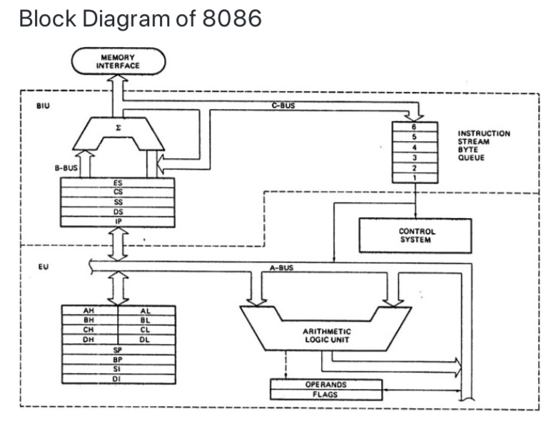
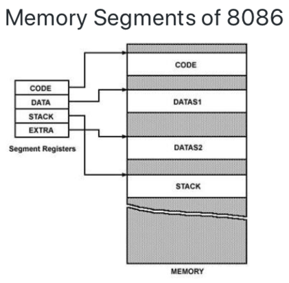
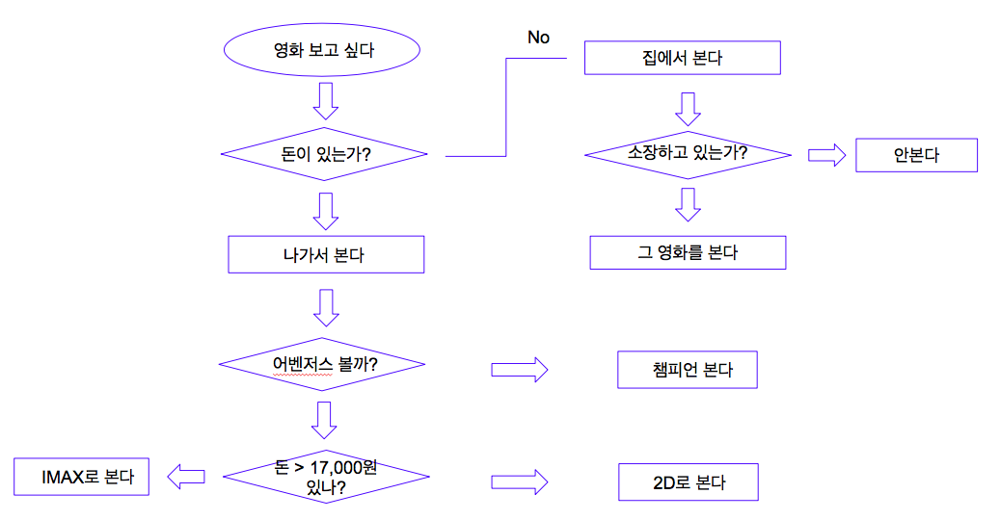

## 수업내용 정리

### 컴퓨터 공학
1. computation : 일련의 과정이 저장되어 있다
    calculation : 연산만 함 

2. Input -> Memory -> Control Unit(Program Counter)[해야할 연산의 순서대로 쌓는다,연산에 주소를 보관] -> Arithmetic Logic Unit(Primitive Operations)[-,+,*,/,AND,OR,NOT] -> Memory -> Output 
> cpu에 명령한다 -> 메모리에 명령을 쌓아 놓는다 -> 그 순서를 기억해두고 순서가 되면 가지고 와서 ALU에서 처리 후 값을 다시 메모리에 저장 -> 값 출력

3. x86 : 인텔8080-8bit -> 8086-16bit(망함, 호환문제) -> 8088-8bit -> 80286-16bit -> 80386 -32bit -> IA64-64bit(망함,호환문제)
	AMD64 : Opteron - x86-64based 64bit(32bit와 64bit 사용 가능) -> Athlon -> AMD Phenom -> AMD FX -> Ryzen

4. CISC & RISC 
- Complex Instruction Set Computers
 - 복잡한 명령구조 
 - 어드레싱에 강점
 - 전력 신경 쓸 필요없이 고성능 컴퓨팅에 사용됨
 - Intel x86, AMD64..

- Reduced Instruction Set Computers
 - 명령어의 단순화 (자주 사용하는 명령어 위주)
 - 메모리 접근 횟수가 적음
 - 저전력 프로세싱에 사용
 - SPARC, ARM..

5. Memory : 컴퓨터에서 사용할 수 있도록 정보를 저장하는 공간
- RAM (Random Access Memory)
 - 자유롭게 읽고 쓸 수 있는 주기억장치
 - 메모리의 주소로 그 위치에 접근
 - 램의 어떤 위치로든 Random access하여 동일한 시간으로 접근
 - 임시메모리가 쌓이기 때문에 리부팅하면 컴퓨터 속도가 빨라짐

- ROM (Read Only Memory)
 - 전원이 공급되지 않아도 그 정보를 유지하는 주기억장치
 - 비싸거나 느려서 안정적인 정보를 저장해야 할 떼 사용
 - BIOS(하드웨어 정보), OS, Firmware 정보 저장에 쓰임

6. OS (Operating System) : 운영체제
- 시스템 하드웨어와 응용 소프트웨어(한글,엘셀..)의 리소스를 관리하는 시스템 소프트웨어
- Unix(Mac OS..),Linux(Ubuntu),Windows(Windows)

7. Patch & Debug
- Patch : 문제를 수정하는 행위
- Debug : 문제를 수정

8. Computational Thinking Process
- 문제인지
 - 영화가 보고싶다
- 문제조직화
 - 문제분해
    - 영화를 본다
      - 돈이 있는가?
        - 집에서 해결함 
          - 집에서 볼게 있나? 
        - 나가서 해결함
          - 2D or IMAX?

- 패턴인지
 - 영화를 보고 싶으면 영화를 봄으로써 False가 됨
- 일반화/추상화
 - 추상화 (간결하고 명확하게 단순화, 일반화, 개념화)
    - ₩₩ 영화를 보고 싶으면 : [어디] 에서 [어떻게] 해결함            
- 알고리즘

- 솔루션 구현
- 솔루션 실행 및 평가